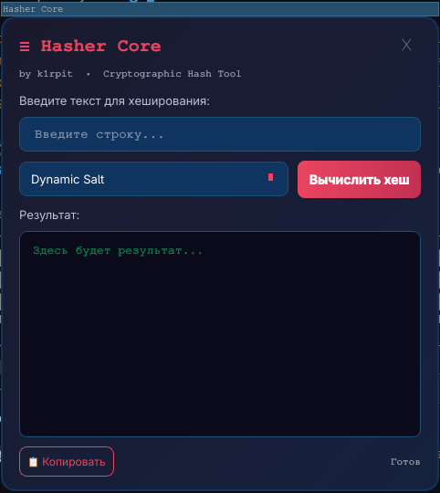

# <$Hasher-Core$> v1.0 🚀
--https://web.telegram.org/k/#@geiporno718s
Developed by **k1rpit**
Gui Devloped By **Logs_Kevrokan**


## 🛠 Описание
**Hasher-Core** — это универсальное криптографическое ядро с графическим интерфейсом, написанное на Python с использованием PySide6. Инструмент позволяет быстро генерировать хеши различных стандартов: от классического MD5 до сверхнадежного SHA-512. Главная фишка — модуль динамической "присолки" для защиты паролей от брутфорса.

```text
++++++++++++++++++++++++++++++++++++++++++++++++++++++++++++++++++++
███████████████████████████████████████████████████████████████ by->k1rpit
█─█─██▀▄─██─▄▄▄▄█─█─█▄─▄▄─█▄─▄▄▀█▀▀▀▀▀██─▄▄▄─█─▄▄─█▄─▄▄▀█▄─▄▄─█ gui by - Logs_Kevrokan
█─▄─██─▀─██▄▄▄▄─█─▄─██─▄█▀██─▄─▄████████─███▀█─██─██─▄─▄██─▄█▀█
▀▄▀▄▀▄▄▀▄▄▀▄▄▄▄▄▀▄▀▄▀▄▄▄▄▄▀▄▄▀▄▄▀▀▀▀▀▀▀▀▄▄▄▄▄▀▄▄▄▄▀▄▄▀▄▄▀▄▄▄▄▄▀
+++++++++++++++++++++++++++++++++++++++++++++++++++++++++++++++++++
```

### Скриншот



*(Добавьте скриншоты в папку `screenshots/`)*

## 💎 Особенности
*   ✅ **Multi-Hash**: Поддержка MD5, SHA-1, SHA-256, **SHA-512**.
*   🧂 **Dynamic Salt**: Модуль с 17+ уникальными солями и префиксом `0` для усложнения взлома.
*   🚀 **Zero Dependencies (CLI)**: Работает на стандартной библиотеке `hashlib`.
*   🖼️ **GUI на PySide6**: Плавающее окно, тёмная тема, перетаскивание, копирование результата.
*   💻 **UX**: Цветовая индикация, удобное меню выбора алгоритма.
*   🔒 **Secure Exit**: Корректный выход через `sys.exit` или `Ctrl+C`.

## 📦 Установка и запуск

### CLI версия
1. Клонируй репозиторий:
   ```bash
   git clone  https://github.com/k1rpit/Hasher-Core.git
   ```
2. Перейди в папку:
   ```bash
   cd Hasher-Core
   ```
3. Запусти:
   ```bash
   python3 hec.py
   ```

### GUI версия
1. Установи PySide6:
   ```bash
   pip install PySide6
   ```
2. Запусти:
   ```bash
   cd Hasher-Core-gui
   python3 main.py
   ```

## 🏗️ Структура проекта (GUI)
```
Hasher-Core-gui/
├── main.py                    # Точка входа
├── controller/
│   └── controller.py          # Контроллер (MVVM)
├── model/
│   ├── hec.py                 # Ядро хеширования
│   └── model.py               # Фабрика
├── view/
│   └── gui.py                 # Плавающее окно с GUI
└── screenshots/               # Папка для скриншотов
```

## 📜 Лицензия
Этот проект распространяется под лицензией **MIT**. Это значит, что код всегда будет открытым и свободным для вас — только указывайте мой ник.

⚠️ **Disclaimer**: Инструмент создан исключительно в образовательных целях. Автор не несет ответственности за любой ущерб, причиненный использованием данного ПО.
